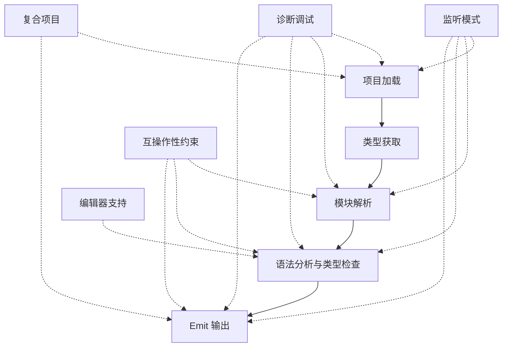

# TypeScript 配置文件参考

## 官方文档

- [TypeScript tsconfig 配置选项](https://www.typescriptlang.org/tsconfig) - TypeScript 官方配置文档

## TypeScript 编译流程与配置项生效阶段

TypeScript 编译流程分为多个阶段，不同类型的配置项在不同阶段起作用。

### 📋 编译流程阶段总览

| 阶段 | 名称 | 说明 |
|------|------|------|
| 1️⃣ | **项目加载阶段**<br>(Project Loading) | 读取和解析 `tsconfig.json`，确定项目结构和包含的文件 |
| 2️⃣ | **类型获取阶段**<br>(Type Acquisition) | 收集和处理类型声明文件，自动获取全局类型定义 |
| 3️⃣ | **模块解析阶段**<br>(Module Resolution) | 解析 import/require 语句，根据模块解析策略找到对应的模块文件 |
| 4️⃣ | **语法分析与类型检查阶段**<br>(Parsing & Type Checking) | 核心阶段，进行语法解析、类型推断和类型检查 |
| 5️⃣ | **Emit 输出阶段**<br>(Emit Phase) | 生成 JavaScript 代码和相关文件（声明文件、source map 等） |
| 6️⃣ | **互操作性约束阶段**<br>(Interop Constraints) | 贯穿多个阶段，确保模块系统兼容性和代码一致性 |
| 7️⃣ | **编辑器与开发体验阶段**<br>(Editor & DX) | 影响 IDE 体验和开发工具行为 |
| 8️⃣ | **监听模式阶段**<br>(Watch Mode) | 仅在 `--watch` 模式下生效，控制文件和目录的监听策略 |
| 9️⃣ | **诊断与调试阶段**<br>(Diagnostics) | 用于调试编译过程，输出详细的诊断信息 |
| 🔟 | **复合项目构建阶段**<br>(Composite Projects) | 用于大型项目的增量编译和项目引用管理 |

---

### 📊 完整流程图



---

### 💡 实用建议

1. **基础配置** (必须理解)：target, module, lib, strict
2. **模块相关** (项目结构)：baseUrl, paths, moduleResolution
3. **严格性** (代码质量)：strict 系列选项
4. **输出控制** (构建产物)：outDir, declaration, sourceMap
5. **性能优化** (大型项目)：incremental, composite, skipLibCheck

---

## 配置项详细说明

### `module`

**作用：** 指定输出代码所使用的模块系统，决定 TypeScript 如何将源码中的 `import`/`export` 语句转换为运行时可识别的模块格式

- **决定输出的模块格式** - 影响代码如何被打包和加载
- **影响模块解析策略** - 改变 `moduleResolution` 的默认行为
- **与 `target` 协同** - 影响语法降级和 JavaScript 版本要求
- **控制类型检查** - 验证导入导出的合法性

---

### `target`

**作用：** 决定了 TypeScript 代码将被编译到哪个 ECMAScript 版本

- 影响默认的 `lib` 选项：隐式地设置默认的 `lib` 配置（即编译时包含的 TypeScript 类型定义库）
- 决定输出代码的兼容范围：低版本 target兼容范围广、体积大；高版本兼容范围窄、体积小
- 默认值受 `module` 影响：
  - `module` 设置为 "node20"，默认 target 为 "es2023"
  - `module` 设置为 "nodenext"，默认 target 为 "esnext"
- 其他选项的协同：`module` -> `target` -> `lib`

---

### `lib`

**作用：** 指定编译时可用的内置 API 类型定义，决定 TypeScript 在类型检查时认为哪些全局对象、方法和属性是存在的

**主要作用：**

1. **提供标准库的类型定义** - 为 JavaScript 内置 API（如 Math、Array、Promise）以及宿主环境（如浏览器中的 document、window）提供类型声明
2. **与 `target` 协同工作** - 不显式设置时，TypeScript 会根据 `target` 自动引入对应的默认库
3. **解决环境差异** - 针对非浏览器环境（Node.js、Deno、Bun）排除不需要的类型（如 DOM）

**默认行为：**
如果不显式设置 `lib`，TypeScript 会根据 `target` 自动包含对应的类型定义：

- `target: "ES5"` → 默认包含 `["dom", "es5", "scripthost"]`
- `target: "ES2020"` → 默认包含 `["dom", "es2020"]`
- `target: "ES2022"` → 默认包含 `["dom", "es2022"]`

**参考文档：** [TypeScript Handbook - lib](https://www.typescriptlang.org/tsconfig#lib)

---

### `moduleResolution`

**作用：** 指定模块解析策略，决定 TypeScript 如何将 `import` 或 `require` 语句中的路径解析为实际的文件

**主要作用：**

1. **连接类型系统与运行时模块机制** - 确保类型检查时的模块查找规则与实际运行时的加载行为一致
2. **支持现代 package.json 特性** - 如 `exports` 和 `imports` 字段
3. **适配不同运行环境** - Node.js、打包器（Webpack/Vite）、Deno 等有各自的模块查找规则

**默认值规则：**
`moduleResolution` 的默认值与 `module` 选项联动：

| `module` 值                             | 默认 `moduleResolution`               |
| --------------------------------------- | ------------------------------------- |
| `CommonJS`                              | `node10`（传统 Node）                 |
| `Node16` / `Node18` / `Node20`          | 对应的 `node16` / `node18` / `node20` |
| `NodeNext`                              | `nodenext`                            |
| `Preserve`                              | `bundler`                             |
| 其他（如 `ES2015`、`ESNext`、`AMD` 等） | `classic`                             |

**与其他选项的配合：**

- **`module`** - 决定输出的模块格式，与 `moduleResolution` 共同决定解析规则的一致性
- **`baseUrl` 和 `paths`** - 自定义非相对模块解析的映射（如 `@/utils`），在 `node16`/`bundler` 模式下也能工作
- **`customConditions`** - 控制 `exports` 字段中自定义条件的匹配顺序（仅在支持 `exports` 的解析模式下有效）

---

### `verbatimModuleSyntax`

**作用：** 严格控制模块语法在编译输出中的保留方式，确保导入/导出语句的类型检查行为与 JavaScript 输出完全一致

---

### `skipLibCheck`

- 跳过node_modules 下.d.ts类型
- 默认false，不跳过
- 为了性能，一般都跳过，是工程选择

---

### `exactOptionalPropertyTypes`

- 不是`strict`：true 默认开启项，需要显式开启
- 解决语义上的不精确问题。区分可选? 符号是“属性不存在”还是“属性值为 undefined”
- 防止代码中意外使用 undefined 作为标记值，导致 in 操作符或 hasOwnProperty 的判断出现偏差

---

### `noImplicitAny`

- 默认false，允许隐式推断（回退）为any
- 与 `strict` 模式联动,是 `strict` 选项组中的一员，启用 `strict` 时会自动开启

---

### `noImplicitOverride`

- 开启（true）：继承场景下，子类覆盖父类强制显式使用 override 修饰符，否则不允许覆盖
- 不是 `strict` 选项组中的一员，需手动开启

---

### `alwaysStrict`

Default: true if strict; false otherwise.

- 开启（true）：继承场景下，子类覆盖父类强制显式使用 override 修饰符，否则不允许覆盖
<!-- - 不是 `strict` 选项组中的一员，需手动开启 -->

---

### `allowImportingTsExtensions`

Default: true if rewriteRelativeImportExtensions; false otherwise.

- 打包器自动处理，不需要写.ts，想直接运行必须.ts, 因此希望allowImportingTsExtensions: true
- 关联属性：开发时写 .ts，发布时输出 .js， rewriteRelativeImportExtensions设为true
- react项目一般开启 allowImportingTsExtensions 是因为TypeScript 只做类型检查，项目要显式导入.tsx文件而不报错，让 TypeScript 的类型检查与打包器处理非标准扩展名的行为保持一致。


#### 何时应该使用？
- **直接运行 TypeScript 的项目**：如使用 `tsx`、`ts-node`、Deno、Bun，或 Node.js 的 `--experimental-strip-types`。这些环境需要导入路径带有完整扩展名（包括 `.ts`），因此开启此选项能让类型检查通过。
- **仅做类型检查的项目**：例如使用打包器构建，TypeScript 只负责类型检查（`noEmit: true`），且打包器可以处理 `.ts` 导入。
- **需要同时开发与发布的库**：可以结合 `rewriteRelativeImportExtensions`，在开发时写 `.ts` 导入，发布时自动改写为 `.js`。

#### 总结
`allowImportingTsExtensions` 是一个“允许语法”的选项，它本身不改变输出行为。它的主要问题在于必须与 `noEmit` 或 `emitDeclarationOnly` 共存，否则编译会报错；如果要在生成 JavaScript 文件的同时使用，则需要额外配置 `rewriteRelativeImportExtensions` 来修正输出路径。在正确配置下，它可以提升开发体验，让代码在直接运行和打包构建之间更加统一。

---

### `baseUrl`

- 历史遗留属性，简化模块引入路径的
- 推荐用 `paths` 替代，并且无需显式设置 `baseUrl`
- `baseUrl` 是解析 `paths` 中目标路径的基准,下面例子中 paths 里的 src/\* 是相对于 baseUrl （"."代表根路径） 的

```json
{
  "compilerOptions": {
    "baseUrl": ".",
    "paths": {
      "@/*": ["src/*"],
      "lib/*": ["common/lib/*"]
    }
  }
}
```

---

### `noUncheckedSideEffectImports`

- noUncheckedSideEffectImports: true, 保证如下 some-module 路径文件存在

```ts
import "some-module";
```

- 配合资源模块声明文件 globals.d.ts 来兼容 CSS、图片等非 JavaScript 导入

---

### `resolveJsonModule`

- 允许导入 .json 文件，并将其内容作为模块使用
- 需要与 module 设置 CommonJS、ES2015 或更高版本
- JSON 导入是只读的

---

### `esModuleInterop`

- 设置为 true 就完事了
- 生成辅助函数兼容 CommonJS 的 require 模块语法，
- allowSyntheticDefaultImports：启用 esModuleInterop 时自动启用，它只影响类型检查，允许在没有默认导出的模块中使用默认导入语法（TypeScript不报错）。

---

### `resolvePackageJsonExports`

Default: true when moduleResolution is node16, nodenext, or bundler; otherwise false

- package.json exports 行为配置
- true:
  - 如果 exports 存在：TypeScript 会遵循其中的映射，并且只允许导入 exports 中明确列出的路径。未在 exports 中声明的子路径将被拒绝，即使该文件实际存在。
  - 如果 exports 不存在：TypeScript 会回退到传统的解析方式（如 main、browser、module 等字段）。

---

### `resolvePackageJsonImports`

- 和 `resolvePackageJsonExports` 差不多，true 就完事了

---

### `rewriteRelativeImportExtensions`

- TypeScript 在编译输出的 JavaScript 文件中，自动将相对导入路径中的 TypeScript 扩展名（.ts、.tsx、.mts、.cts）改写为对应的 JavaScript 扩展名（.js、.jsx、.mjs、.cts）
- 原因：支持直接运行 TypeScript 文件的工具链要求导入语句必须使用完整的扩展名，包括 .ts
- 解决了这个问题：它允许你在源码中写 .ts 扩展名，而编译器在输出 JavaScript 文件时会自动将 .ts 改为 .js

---

### `rootDir`

- 指定 TypeScript 编译时输入文件的根目录，它决定了输出目录（outDir）中的文件结构
- 默认情况下，TypeScript 会取所有非声明输入文件的最长公共路径作为 rootDir（有.ts文件的最短文件夹路径）
- 所有需要输出的文件必须位于 rootDir 下
- composite: true， rootDir 的默认值变为 tsconfig.json 所在目录

---
